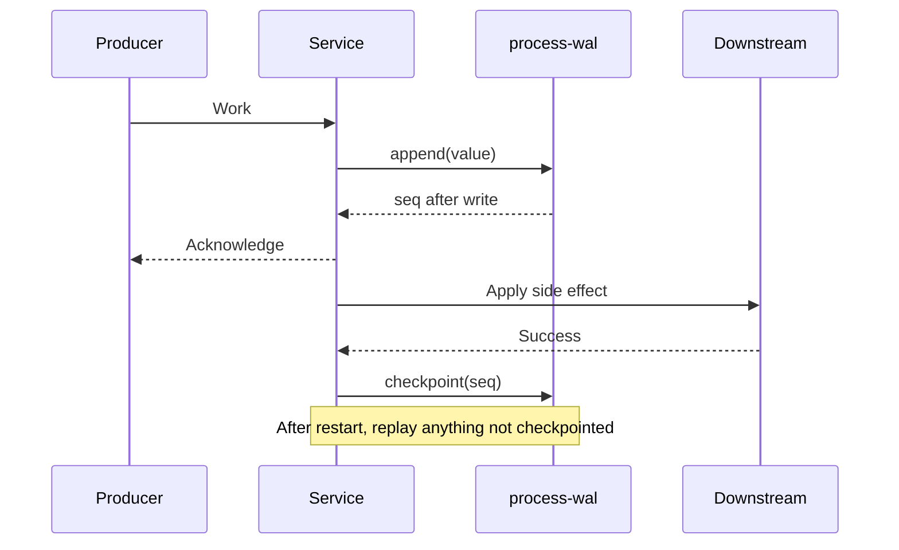

# process-wal

```text
┌─[ process-wal ]──────────────────────────────────────────────┐
│ $ durability --scope=process --writer=single --deps=0        │
│ > append ──▶ replay ──▶ checkpoint                  [READY]  │
└──────────────────────────────────────────────────────────────┘
```

[](https://github.com/AndresSaa/process-wal/actions/workflows/ci.yml)
[](package.json)
[](src)
[](package.json)
[](package.json)
[](LICENSE)

Durability across Node.js process restarts — without SQLite, Redis, a broker, or
native binaries. Pure TypeScript, zero runtime dependencies, one clear job.

```sh
docker restart my-service # the process dies; its persistent disk survives
```

If a service acknowledges work before it is recoverable, a restart can silently
drop it. `process-wal` closes that gap: append accepted work before acknowledging
it, replay anything not checkpointed, and compact the log when convenient.

The package is intentionally local, synchronous, and single-writer. That
smallness is the design boundary, not an incomplete queue.

## Install

Requires Node.js 22 or newer.

```sh
npm install process-wal
```

The implementation is complete, but the package remains unreleased at `0.0.0`.
The command above applies after the first npm release.

## Quick start

```ts
import { createWal } from "process-wal";

const wal = createWal<{ jobId: string }>({ dir: "./data" });

// Persist before acknowledging the job to its producer.
const seq = wal.append({ jobId: "job-42" });
acknowledgeJob(seq);

// On startup, redo only work that was not checkpointed.
for (const entry of wal.replay()) {
  await processJob(entry.value);
  wal.checkpoint(entry.seq);
}

wal.compact();
wal.close();
```



`append`, `checkpoint`, `compact`, and `close` are synchronous by design. A
successful `append` means the complete record reached the selected durability
boundary before its sequence number was returned.

## Durability model

A normal synchronous write reaches the kernel page cache. The cache outlives a
process crash, deploy, container restart, or `SIGKILL` while the host stays up.
It does not guarantee survival if the host loses power.

| Mode                     | Process restart | Host or power loss                         | Measured mean append |
| ------------------------ | --------------- | ------------------------------------------ | -------------------: |
| `fsync: false` (default) | Recoverable     | Not guaranteed                             |            0.0046 ms |
| `fsync: true`            | Recoverable     | Requests an OS storage flush before return |            0.5520 ms |

With `fsync: true`, the flush path covers appends, checkpoint replacement, and
compaction. Filesystem, storage-controller, and hardware guarantees still apply;
no userspace library can strengthen them.

> The page cache is a receptionist; storage is a fireproof safe. Handing over a
> note is fast and survives you leaving the building. Waiting for the safe costs
> more, but is the appropriate boundary if the building itself may fail.

### At-least-once, not exactly-once

Append before acknowledging incoming work, then checkpoint only after its side
effect succeeds. A crash between the side effect and the checkpoint replays work
that may already have happened, so consumers must be idempotent.

```ts
for (const { seq, value } of wal.replay()) {
  // Use an identity from the payload, not the WAL seq, as the deduplication key.
  await db.upsert("payments", { id: value.paymentId }, value);
  wal.checkpoint(seq);
}
```

Exactly-once delivery requires transactional coordination with the downstream
system and is deliberately outside this library.

## Design decisions

| Requirement                            | Decision                                             | Consequence                                                         |
| -------------------------------------- | ---------------------------------------------------- | ------------------------------------------------------------------- |
| Recover accepted work after a restart  | Append before returning a sequence number            | The append path is synchronous                                      |
| Keep the common path inexpensive       | Page cache is the default durability boundary        | Host-loss durability is opt-in                                      |
| Support stronger local durability      | `fsync` is explicit and applies to every state write | Latency depends heavily on the filesystem and device                |
| Stay zero-dependency and portable      | JSONL plus Node filesystem primitives                | Values must be JSON-serializable; there is no query layer           |
| Bound replay memory for large backlogs | Frozen async cursor with its own descriptor          | Compaction waits for open cursors, which is also correct on Windows |
| Prefer recovery over hidden loss       | Corrupt checkpoints fall back to zero                | Recovery may repeat extra work but never skips it                   |
| Keep compaction usable on large logs   | Compaction streams survivors instead of loading them | Bounds file growth on the logs that most need it                    |

Checkpoint and compaction write a temporary file and replace the live file with
`rename`. A crash can leave a `.tmp` file, but not a half-written live
checkpoint. On startup, a final record without `\n` is treated as an interrupted
append and truncated before another append can weld valid JSON onto it. A
complete corrupt record fails loudly rather than disappearing.

Sequence numbers are monotonic within an instance. An interrupted append that
never returned may have its sequence number reused after restart; the API does
not promise gap-free numbering.

### Recovering from a refusal to open

`createWal` throws a `SyntaxError` when the log contains a record that is
complete — newline-terminated — but unparseable, or whose sequence number does
not increase. This is deliberate. A torn final record is an interrupted append
nobody was promised, so it is truncated silently; a _complete_ damaged record
was fully written and then corrupted by something else, and skipping it would
drop work the library had already acknowledged.

Repair is a manual, one-time operation because deleting a record is a data-loss
decision no library should take on its own:

```sh
# 1. Stop the writer, then keep a copy before touching anything.
cp data/wal.jsonl data/wal.jsonl.broken

# 2. Every line is independent JSON. Find the ones that do not parse.
node -e 'require("node:fs").readFileSync("data/wal.jsonl","utf8").split("\n")
  .forEach((l,i)=>{ if(!l) return;
    try { JSON.parse(l) } catch { console.log("line", i+1, JSON.stringify(l.slice(0,120))) } })'

# 3. Remove or repair those lines, keeping sequence numbers increasing, then
#    reopen. Whatever was in a deleted record is gone — replay cannot restore it.
```

If the checkpoint file is the damaged one, no repair is needed: a corrupt
`wal.checkpoint` falls back to zero and the whole log replays. That repeats
already-finished work, which is safe for the idempotent consumers this library
already requires, and never skips work.

## When it fits

| Scenario                               | Why this WAL fits                                                      |
| -------------------------------------- | ---------------------------------------------------------------------- |
| Small webhook receiver                 | Survive deploys without adding a queue service                         |
| Ingestion buffer on persistent storage | Absorb local work and flush it downstream after restart                |
| Electron or desktop application        | Persist drafts, uploads, or pending operations without native bindings |
| Resumable CLI, scraper, migration, ETL | Continue from a checkpoint; stream a large backlog with `cursor()`     |
| Edge or IoT agent                      | Buffer telemetry through intermittent downstream connectivity          |

## When not to use it

- Serverless or otherwise ephemeral filesystems.
- Multiple processes writing to the same WAL directory.
- Replicated or distributed durability.
- Work that requires transactions, queries, priorities, leases, or routing.
- A system that already owns the relevant data in a transactional database; use
  an outbox in that database instead.

## API

```ts
const wal = createWal<T>({
  dir: "./data",
  fsync: false,
  compactInterval: null,
  maxEntryBytes: 1_048_576,
});
```

| Method                 | Contract                                                                                |
| ---------------------- | --------------------------------------------------------------------------------------- |
| `append(value)`        | JSON-serializes and persists a value, then returns its monotonic sequence number        |
| `checkpoint(seq)`      | Marks every entry through `seq` processed; lower or equal checkpoints are no-ops        |
| `replay()`             | Materializes entries after the current checkpoint in append order                       |
| `cursor({ fromSeq? })` | Streams an exclusive-`fromSeq`, checkpoint-and-file-size snapshot                       |
| `compact()`            | Atomically removes checkpointed records; defers while any cursor owns a file descriptor |
| `close()`              | Clears the unref'ed compaction timer, optionally flushes, and releases the writer       |

A checkpoint beyond the last append is valid and advances the next sequence
number. This prevents a future append from being hidden below the checkpoint.

Every method throws an error with `code: "ERR_WAL_CLOSED"` after `close()`.
`append` can throw `ERR_ENTRY_TOO_LARGE` or
`ERR_ENTRY_NOT_SERIALIZABLE`. Stable codes, rather than exported error classes,
are the public error contract.

Two lifecycle details worth knowing before they surprise you:

- **`close()` is not idempotent.** It is a method like any other, so a second
  call throws `ERR_WAL_CLOSED`. Calling it from a `finally` block that can run
  twice, or from both a shutdown handler and a normal path, will throw on the
  second call — guard it if your shutdown path is not exactly-once.
- **A cursor owns its descriptor until it finishes.** Draining it, `break`ing
  out of a `for await`, or calling `return()` all release it. Abandoning one
  without doing any of those keeps the descriptor open for the life of the
  process, which also leaves the file locked on Windows and defers `compact()`
  indefinitely. `close()` releases the writer, not other people's cursors.

### Large backlogs

`replay()` is convenient for bounded queues. `cursor()` keeps iteration memory
bounded and freezes its checkpoint and byte length when created:

```ts
for await (const { seq, value } of wal.cursor({ fromSeq: 0 })) {
  await processJob(value);
  wal.checkpoint(seq);
}
```

### Optional persistence

`createNoopWal<T>()` exposes the same lifecycle and sequence shape without disk
I/O. It is a dependency-injection seam for applications where persistence is
configurable:

```ts
const wal = persistenceEnabled ? createWal(options) : createNoopWal();
```

## Operational profile

| Operation  | Time                    | Memory                                | Disk behavior                                   |
| ---------- | ----------------------- | ------------------------------------- | ----------------------------------------------- |
| Open       | O(log bytes) validation | One entry plus a 64 KiB scan buffer   | Heals an incomplete final record                |
| Append     | O(entry bytes)          | One encoded record                    | Append; optional `fsync`                        |
| Checkpoint | O(1)                    | Constant                              | Temp file, flush when enabled, then rename      |
| Replay     | O(log bytes)            | Materializes the log before filtering | Read only                                       |
| Cursor     | O(snapshot bytes)       | Stream buffer plus current entry      | Own read descriptor; frozen end offset          |
| Compact    | O(log bytes)            | One entry plus a 64 KiB scan buffer   | Temporary replacement; briefly needs extra disk |

`replay()` is the only operation that materializes the log, which is why
`cursor()` exists for backlogs that will not fit in memory comfortably. Open,
compaction, and cursors all stream.

The optional `compactInterval` timer is unref'ed, so it cannot keep a process
alive. Nothing awaits that timer, so a failure inside it is reported with
`process.emitWarning` — visible on stderr by default and catchable via
`process.on("warning", …)` — rather than silently leaving the log to grow.
Manual compaction makes disk-growth policy explicit and is the simplest default.

The library creates `wal.jsonl`, `wal.checkpoint`, and temporary replacement
files inside `dir`; it does not take ownership of other files there.

## Alternatives

- [better-sqlite3](https://github.com/WiseLibs/better-sqlite3) is the stronger
  choice when you need SQLite transactions, indexing, or queries and accept a
  native binding.
- A [transactional outbox](https://docs.aws.amazon.com/prescriptive-guidance/latest/cloud-design-patterns/transactional-outbox.html)
  is the right boundary when business state already lives in a database and the
  state change and emitted work must commit together.
- [Apache Kafka](https://kafka.apache.org/documentation/) and
  [RabbitMQ](https://www.rabbitmq.com/docs/queues) provide distributed streaming
  or brokered queues when local single-process durability is not enough.

`process-wal` occupies the narrower gap: one process, one local writer, one
append-and-replay responsibility, and no new runtime or service dependency.

## Origin and implementation

This is an extraction from a production ingestion writer, not a speculative
abstraction. The original boundary was concrete: append before acknowledging an
incoming measurement, batch downstream writes, then checkpoint only the last
successfully persisted sequence. Application-specific batching, retry,
backpressure, and transport concerns remain outside the package.

The source is split by responsibility:

- `src/wal.ts` owns lifecycle, sequencing, compaction, and public orchestration.
- `src/cursor.ts` owns frozen streaming snapshots and descriptor release.
- `src/storage.ts` owns bounded-memory validation, recovery, flushing, and atomic
  replacement primitives.
- `src/noop.ts` mirrors the lifecycle without storage.
- `src/types.ts` is the complete public contract.

Comments explain only the non-obvious guarantees. Real-filesystem tests are the
executable specification: torn writes, corrupt checkpoints, deferred Windows
compaction, `SIGKILL` recovery, and bounded RSS for both cursors and compaction
are all exercised.

Set `NODE_DEBUG=process-wal` to inspect heal-on-open, deferred compaction, and
checkpoint fallback branches.

## Performance

Measured by `npm run bench` on Windows 11, Node 22.22.2, an AMD Ryzen 9 5900X,
and a GIGABYTE GP-ASM2NE6100TTTD SSD:

| Mode           |      Mean |       p75 |       p99 |    Throughput |
| -------------- | --------: | --------: | --------: | ------------: |
| `fsync: false` | 0.0046 ms | 0.0048 ms | 0.0102 ms | 217,806 ops/s |
| `fsync: true`  | 0.5520 ms | 0.5582 ms | 0.7407 ms |   1,812 ops/s |

Each mode uses 100 warm-up appends and 10,000 measured appends of
`{ value: 42 }`. These compare durability modes on one machine, not machines;
rerun the benchmark on the deployment filesystem before making a capacity
decision.

## Development

```sh
npm ci
npm run lint
npm test
npm run coverage
npm run bench
npm run lint:package
```

CI runs lint, coverage, package validation, and the durability suite on Node 22
and 24 across Linux, macOS, and Windows.

Release notes are tracked in [CHANGELOG.md](CHANGELOG.md). Until the release
tooling lands, user-visible changes are recorded under `[Unreleased]`.

## License

MIT
